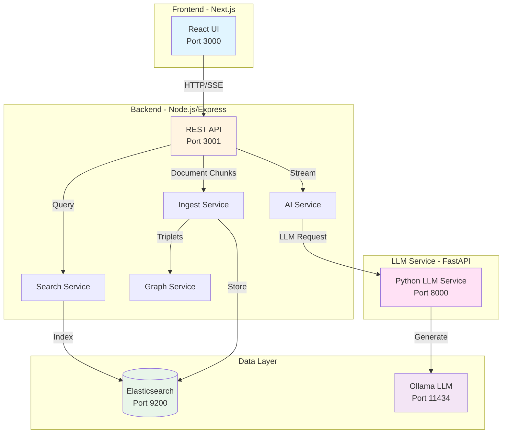

# InsightGraph Platform

> A production-ready RAG system with streaming LLM responses, built with clean architecture and polyglot microservices

InsightGraph demonstrates how to build a **scalable AI-powered document search system** with proper engineering practices. This project showcases backend-first development, microservice architecture, and real-time streaming - all without over-engineering.

**Built by a Senior Full-Stack Engineer** to demonstrate system design, API development, and practical AI integration.

---

## Project Goal

Enable users to **ask natural language questions** about their documents and receive **AI-generated answers** grounded in actual source data, with:

- Real-time token streaming (ChatGPT-style UX)
- Source attribution and relevance scoring
- Document chunking for precise RAG retrieval
- Polyglot microservices (Node.js + Python)

---

## Architecture



### **System Flow**

1. **Upload**: User uploads document → Backend chunks it (512 tokens) → Stores in Elasticsearch with metadata
2. **Search**: Query hits ES → Returns top chunks with relevance scores
3. **Ask**: Question → Search top chunks → Build context → Stream to FastAPI → Ollama generates → Backend forwards tokens → Frontend displays real-time
4. **Graph**: Extract triplets from documents → Build knowledge graph

---

## API Endpoints

### **Upload Document**

```bash
POST /upload
Content-Type: application/json

{
  "title": "My Document",
  "content": "Document text content here..."
}
```

**Response:**

```json
{
  "ok": true,
  "indexed": "My Document",
  "chunksCreated": 2,
  "triplets": [...],
  "graph": { "nodes": [...], "edges": [...] }
}
```

**Features:**

- Automatically chunks documents into 512-token segments with 100-token overlap
- Stores chunk metadata (sourceId, chunkIndex, positions, totalChunks)
- Extracts knowledge graph triplets
- Indexes in Elasticsearch for fast retrieval

---

### **Ask Question (Non-Streaming)**

```bash
POST /ask
Content-Type: application/json

{
  "question": "What are microservices?"
}
```

**Response:**

```json
{
  "answer": "Microservices are...",
  "sources": [
    {
      "id": "doc#chunk_0",
      "title": "Architecture Guide (Part 1/3)",
      "score": 8.52
    }
  ]
}
```

**Flow:**

1. Search Elasticsearch for relevant chunks
2. Build context from top 5 chunks with highlights
3. Send to FastAPI → Ollama for answer generation
4. Return complete answer with source attribution

---

### **Ask Question (Streaming)**

```bash
POST /ask/stream
Content-Type: application/json

{
  "question": "Explain containerization"
}
```

**Response (Server-Sent Events):**

```
data: {"type":"answer","content":"Container"}
data: {"type":"answer","content":"ization"}
data: {"type":"answer","content":" is"}
data: {"type":"sources","sources":[...]}
data: [DONE]
```

**Features:**

- Real-time token streaming (ChatGPT-style UX)
- Progressive answer building on frontend
- Source attribution sent after completion
- Proper SSE format with `data: ` prefix and `\n\n` separators

---

## Quick Start

### **Prerequisites**

- Node.js 18+ and npm
- Python 3.12+ with pip
- Elasticsearch 8.x running on port 9200
- Ollama installed with `llama3.1` model

### **Setup**

**1. Start Elasticsearch**

```bash
# macOS with Homebrew
brew services start elasticsearch

# Docker
docker run -d -p 9200:9200 -e "discovery.type=single-node" elasticsearch:8.11.0
```

**2. Start Ollama & Pull Model**

```bash
ollama serve  # Start Ollama server
ollama pull llama3.1  # Download model
```

**3. Backend Setup**

```bash
cd backend
npm install
npm run dev  # Runs on http://localhost:3001
```

**4. FastAPI LLM Service**

```bash
cd llm-service
python -m venv venv
source venv/bin/activate  # Windows: venv\Scripts\activate
pip install -r requirements.txt
uvicorn main:app --reload --port 8000
```

**5. Frontend**

```bash
cd frontend
npm install
npm run dev  # Runs on http://localhost:3000
```

---

## Example Usage

### **1. Upload a Document**

```bash
curl -X POST http://localhost:3001/upload \
  -H "Content-Type: application/json" \
  -d '{
    "title": "Docker Guide",
    "content": "Docker is a platform for developing, shipping, and running applications in containers. Containers are lightweight, standalone packages that include everything needed to run an application."
  }'
```

### **2. Ask a Question (Streaming)**

```bash
curl -X POST http://localhost:3001/ask/stream \
  -H "Content-Type: application/json" \
  -d '{"question":"What is Docker?"}' \
  | grep "^data:"
```

### **3. View in Browser**

Open `http://localhost:3000` and:

- Click "Upload Documents" → paste text or upload file
- Click "Ask AI" → type question → watch streaming response
- Click "Explore Graph" → visualize knowledge connections

---

## Example Prompts to Try

After uploading documents about software architecture:

**Beginner Questions:**

- "What is a microservice?"
- "Explain Docker containers"
- "What does CI/CD mean?"

**Technical Questions:**

- "Compare monolithic vs microservices architecture"
- "How do service meshes work?"
- "What are the trade-offs of containerization?"

**Specific Queries:**

- "Which documents mention Kubernetes?"
- "Summarize the deployment strategies discussed"
- "What are the main challenges with distributed systems?"

---

## Technical Architecture & Design Decisions

### **Why Polyglot Microservices?**

**Node.js Backend (Express)**

- Fast async I/O for API orchestration
- Rich ecosystem for web APIs
- TypeScript for type safety
- Easy integration with Elasticsearch

**Python FastAPI for LLM**

- Best ecosystem for AI/ML (httpx, Ollama SDK)
- FastAPI's native async streaming support
- Clean separation of concerns
- Easy to swap LLM providers

**Trade-off:** Added complexity of two services vs. benefits of using best tool for each job

---

### **Why Document Chunking?**

**Problem:** Full documents are too large for LLM context windows and reduce retrieval precision.

**Solution:** Split into 512-token chunks with 100-token overlap

- **Benefits:**
  - More relevant context retrieval
  - Better ES ranking (smaller = more focused)
  - Fits LLM context limits
  - Overlap preserves continuity
- **Metadata Tracking:**
  - `sourceId`, `sourceTitle` - link back to original
  - `chunkIndex`, `totalChunks` - position tracking
  - `startPosition`, `endPosition` - exact location in source

**Implementation:** `backend/src/utils/chunking.ts`

---

### **Why Avoid Over-Engineering?**

**What I Didn't Build (Yet):**

- ❌ Vector embeddings (used ES full-text search instead)
- ❌ Complex caching layers (ES is fast enough)
- ❌ User authentication (focus on core functionality)
- ❌ Distributed tracing (single-machine deployment)
- ❌ Message queues (direct API calls suffice)

**Why:**

- **Iterate Fast:** Get core working first, add complexity when needed
- **Understand Fundamentals:** ES full-text search works surprisingly well
- **Interview Clarity:** Easier to explain simpler systems
- **Production Ready:** Can scale when requirements demand it

**When to Add:**

- Vector embeddings: When semantic search quality matters more
- Caching: When ES query latency becomes bottleneck
- Auth: When deploying for multiple users
- Message queue: When async job processing needed

---

## Project Structure

```
fullstack_insightgraph_AI/
├── backend/                 # Node.js/Express API
│   ├── src/
│   │   ├── routes/          # API endpoints
│   │   │   ├── ask.ts       # /ask & /ask/stream
│   │   │   ├── upload.ts    # /upload
│   │   │   └── graph.ts     # /graph
│   │   ├── services/
│   │   │   ├── aiService.ts      # LLM integration
│   │   │   ├── searchService.ts  # Elasticsearch
│   │   │   ├── ingestService.ts  # Document processing
│   │   │   └── graphService.ts   # Knowledge graph
│   │   └── utils/
│   │       ├── chunking.ts       # Document chunking
│   │       ├── fileParser.ts     # File processing
│   │       └── logger.ts         # Winston logging
│   └── package.json
│
├── llm-service/             # Python FastAPI
│   ├── main.py              # FastAPI app
│   ├── requirements.txt
│   └── README.md
│
├── frontend/                # Next.js React
│   ├── app/
│   │   ├── page.tsx         # Home page
│   │   ├── ask/page.tsx     # Ask AI page
│   │   ├── upload/page.tsx  # Upload page
│   │   └── graph/page.tsx   # Graph visualization
│   ├── components/
│   │   ├── AskBox.tsx       # Streaming Q&A
│   │   ├── GraphView.tsx    # D3.js graph
│   │   └── Navbar.tsx
│   └── package.json
│
└── README.md                # This file
```

---

GET /documents/:id/summary/stream

````

- Returns SSE stream of summary tokens

---

## Testing

### Test FastAPI Service Directly - Week 6

```bash
# Health check
curl http://localhost:8000/health

# Test ask endpoint (non-streaming)
curl -X POST http://localhost:8000/llm/ask \
  -H "Content-Type: application/json" \
  -d '{
    "question": "What is FastAPI?",
    "context": "FastAPI is a modern, fast web framework for building APIs with Python."
  }'

# Test streaming endpoint
curl -N http://localhost:8000/llm/stream \
  -H "Content-Type: application/json" \
  -d '{
    "question": "Explain microservices",
    "context": "Microservices are an architectural style that structures an application as a collection of small autonomous services."
  }'
```

### Test Through Node.js Backend

```bash
# First, upload a document
curl -X POST http://localhost:3001/upload \
  -F "file=@your-document.txt"

# Then ask a question (non-streaming)
curl -X POST http://localhost:3001/ask \
  -H "Content-Type: application/json" \
  -d '{"question": "What is this document about?"}'

# Ask with streaming
curl -N -X POST http://localhost:3001/ask/stream \
  -H "Content-Type: application/json" \
  -d '{"question": "Summarize the key points"}'

# Get document summary
curl -X POST http://localhost:3001/documents/YOUR_DOC_ID/summary
```

---

## License

MIT
````
