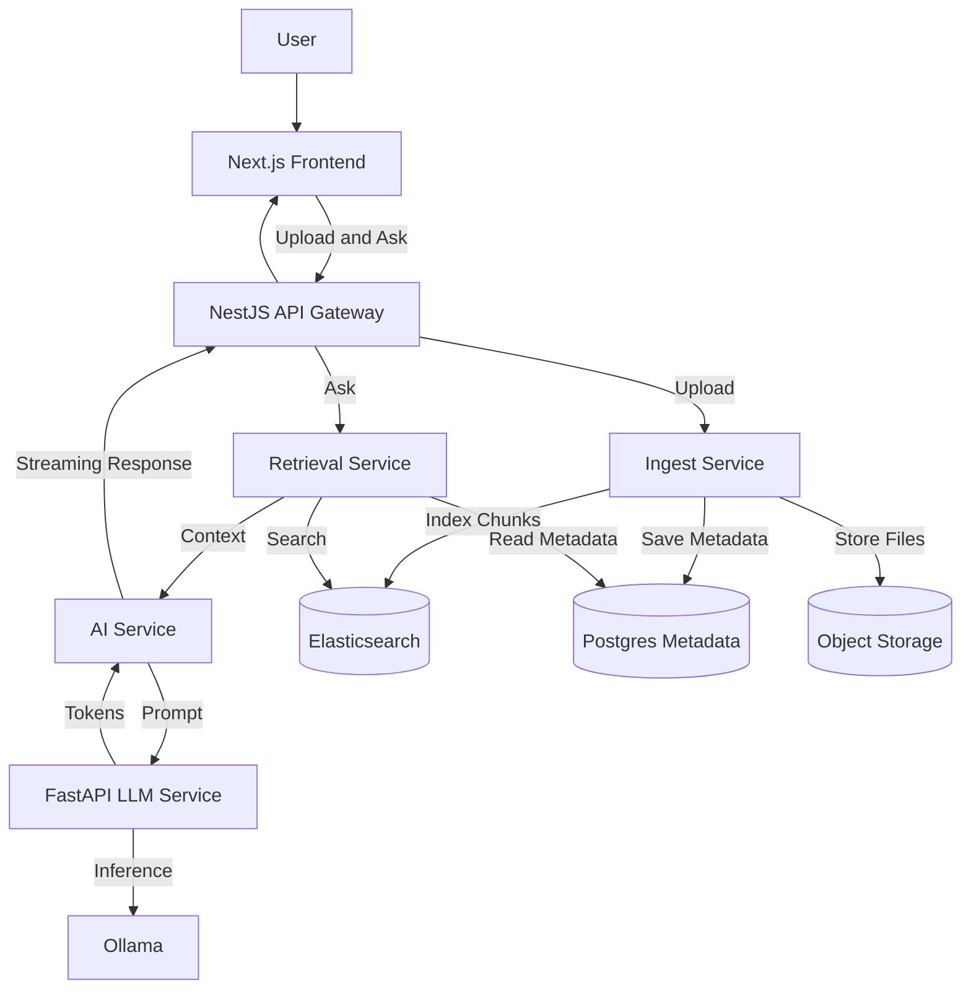

# InsightGraph Platform

> InsightGraph demonstrates how to build an **AI-powered document search system** with solid engineering practices.

InsightGraph is a retrieval-augmented generation system where users ask natural language questions about uploaded documents and receive AI-generated answers with:

- Real-time token streaming (ChatGPT-style SSE responses)
- Document chunking for precise RAG retrieval (512-token chunks, 100-token overlap)
- Source attribution and relevance scoring
- RAG pipeline: NestJS retrieves top chunks from Elasticsearch and FastAPI generates answer with Ollama
- Microservices (NestJS for retrieval/orchestration + Python FastAPI for LLM generation)

## Industry Use Cases

Enterprise knowledge assistant
Employees upload SOPs, onboarding docs, architecture docs, policies, and ask questions with cited answers.

Customer support copilot
Support teams search manuals, runbooks, troubleshooting guides, and get grounded answers faster.

Other internal knowledge retrieval workflows follow the same pattern.

## Tech Stack

Frontend: Next.js
Backend: NestJS API
LLM sidecar: FastAPI service
Search store: Elasticsearch
Cache: Redis
Model runtime: Ollama

## Architecture



### **System Flow**

1. **Upload**: User uploads a document to the API
2. **Ingest**: Ingest service parses, chunks, embeds, and indexes data
3. **Retrieve**: Retrieval service gets the best chunks from Elasticsearch
4. **Generate**: AI service calls FastAPI LLM service with retrieved context
5. **Stream**: Tokens and source info stream back to the UI in real time

## Request Flow

Run the frontend on port 3000

Run the backend on port 3001:

1. It searches Elasticsearch and may read or write Redis cache on port 6379.
2. It calls the FastAPI LLM service on port 8000.
3. FastAPI calls Ollama on port 11434.
4. The backend supports **both** non-streaming (`/ask`) and streaming (`/ask/stream`) question endpoints:

- `/ask`: Returns a complete answer and sources as JSON.
- `/ask/stream`: Returns a real-time, token-by-token answer using Server-Sent Events (SSE).

5. The frontend can use either endpoint depending on the use case.

## API Endpoints

### **Upload Document**

```bash
POST /upload
Content-Type: application/json

{
  "title": "My Document",
  "content": "Document text content here..."
}
```

**Response:**

```json
{
  "ok": true,
  "indexed": "My Document",
  "chunksCreated": 2,
  "triplets": [...],
  "graph": { "nodes": [...], "edges": [...] }
}
```

**Features:**

- Automatically chunks documents into 512-token segments with 100-token overlap
- Stores chunk metadata (sourceId, chunkIndex, positions, totalChunks)
- Extracts knowledge graph triplets
- Indexes in Elasticsearch for fast retrieval

---

### **Ask Question (Non-Streaming)**

```bash
POST /ask
Content-Type: application/json

{
  "question": "What are microservices?"
}
```

**Response:**

```json
{
  "answer": "Microservices are...",
  "sources": [
    {
      "id": "doc#chunk_0",
      "title": "Architecture Guide (Part 1/3)",
      "score": 8.52
    }
  ]
}
```

**Flow:**

1. Search Elasticsearch for relevant chunks
2. Build context from top 5 chunks with highlights
3. Send to FastAPI → Ollama for answer generation
4. Return complete answer with source attribution

---

### **Ask Question (Streaming)**

```bash
POST /ask/stream
Content-Type: application/json

{
  "question": "Explain containerization"
}
```

**Response (Server-Sent Events):**

```
data: {"type":"answer","content":"Container"}
data: {"type":"answer","content":"ization"}
data: {"type":"answer","content":" is"}
data: {"type":"sources","sources":[...]}
data: [DONE]
```

**Features:**

- Real-time token streaming (ChatGPT-style UX)
- Progressive answer building on frontend
- Source attribution sent after completion
- Proper SSE format with `data: ` prefix and `\n\n` separators

---

## Quick Start

### **Prerequisites**

- Node.js 22.19.0 and npm
- Python 3.12+ with pip
- Elasticsearch 8.x running on port 9200
- Ollama installed with `llama3.1` model

### **Setup**

**1. Start Elasticsearch**

```bash
# macOS with Homebrew
brew services start elasticsearch

# Docker
docker run -d -p 9200:9200 -e "discovery.type=single-node" elasticsearch:8.11.0
```

**2. Start Ollama & Pull Model**

```bash
ollama serve  # Start Ollama server
ollama pull llama3.1  # Download model
```

**3. Backend Setup**

```bash
cd backend
npm install
npm run dev  # Runs NestJS API on http://localhost:3001
```

**4. FastAPI LLM Service**

```bash
cd llm-service
python -m venv venv
source venv/bin/activate  # Windows: venv\Scripts\activate
pip install -r requirements.txt
uvicorn main:app --reload --port 8000
```

**5. Frontend**

```bash
cd frontend
npm install
npm run dev  # Runs on http://localhost:3000
```

---

## Example Usage

### **1. Upload a Document**

```bash
curl -X POST http://localhost:3001/upload \
  -H "Content-Type: application/json" \
  -d '{
    "title": "Docker Guide",
    "content": "Docker is a platform for developing, shipping, and running applications in containers. Containers are lightweight, standalone packages that include everything needed to run an application."
  }'
```

### **2. Ask a Question (Non-Streaming)**

```bash
curl -X POST http://localhost:3001/ask \
  -H "Content-Type: application/json" \
  -d '{"question":"What is Docker?"}'
```

**Response:**

```json
{
  "answer": "Docker is a platform for...",
  "sources": [
    {
      "id": "doc#chunk_0",
      "title": "Docker Guide",
      "score": 9.12
    }
  ]
}
```

### **3. Ask a Question (Streaming)**

```bash
curl -X POST http://localhost:3001/ask/stream \
  -H "Content-Type: application/json" \
  -d '{"question":"What is Docker?"}' \
  | grep "^data:"
```

### **4. View in Browser**

Open `http://localhost:3000` and:

- Click "Upload Documents" → paste text or upload file
- Click "Ask AI" → type question → watch streaming response
- Click "Explore Graph" → visualize knowledge connections

---

## Example Prompts to Try

After uploading documents about software architecture:

**Beginner Questions:**

- "What is a microservice?"
- "Explain Docker containers"
- "What does CI/CD mean?"

**Technical Questions:**

- "Compare monolithic vs microservices architecture"
- "How do service meshes work?"
- "What are the trade-offs of containerization?"

**Specific Queries:**

- "Which documents mention Kubernetes?"
- "Summarize the deployment strategies discussed"
- "What are the main challenges with distributed systems?"

---

## Technical Architecture & Design Decisions

### **Why Polyglot Microservices?**

**Node.js Backend (NestJS)**

- Fast async I/O for API orchestration
- Modular architecture (controllers, providers, modules)
- TypeScript for type safety
- Runs on NestJS with the Express adapter
- Easy integration with Elasticsearch

**Python FastAPI for LLM**

- Best ecosystem for AI/ML (httpx, Ollama SDK)
- FastAPI's native async streaming support
- Clean separation of concerns
- Easy to swap LLM providers

**Trade-off:** Added complexity of two services vs. benefits of using best tool for each job

---

### **Why Document Chunking?**

**Problem:** Full documents are too large for LLM context windows and reduce retrieval precision.

**Solution:** Split into 512-token chunks with 100-token overlap

- **Benefits:**
  - More relevant context retrieval
  - Better ES ranking (smaller = more focused)
  - Fits LLM context limits
  - Overlap preserves continuity
- **Metadata Tracking:**
  - `sourceId`, `sourceTitle` - link back to original
  - `chunkIndex`, `totalChunks` - position tracking
  - `startPosition`, `endPosition` - exact location in source

**Implementation:** `backend/src/utils/chunking.ts`

---

### **Why Avoid Over-Engineering?**

**What I Didn't Build (Yet):**

- ❌ Vector embeddings (used ES full-text search instead)
- ❌ Complex caching layers (ES is fast enough)
- ❌ User authentication (focus on core functionality)
- ❌ Distributed tracing (single-machine deployment)
- ❌ Message queues (direct API calls suffice)

**Why:**

- **Iterate Fast:** Get core working first, add complexity when needed
- **Understand Fundamentals:** ES full-text search works surprisingly well
- **Interview Clarity:** Easier to explain simpler systems
- **Production Ready:** Can scale when requirements demand it

**When to Add:**

- Vector embeddings: When semantic search quality matters more
- Caching: When ES query latency becomes bottleneck
- Auth: When deploying for multiple users
- Message queue: When async job processing needed

---

## Project Structure

```
fullstack_insightgraph_AI/
├── backend/                 # NestJS API
│   ├── src/
│   │   ├── controllers/     # NestJS route handlers
│   │   │   ├── ask.controller.ts
│   │   │   ├── documents.controller.ts
│   │   │   ├── graph.controller.ts
│   │   │   ├── search.controller.ts
│   │   │   └── upload.controller.ts
│   │   ├── common/          # Shared NestJS filters
│   │   │   └── filters/
│   │   ├── main.ts          # NestJS bootstrap
│   │   ├── app.module.ts    # Root module
│   │   ├── routes/          # Legacy Express routes kept during migration
│   │   ├── services/
│   │   │   ├── aiService.ts      # LLM integration
│   │   │   ├── searchService.ts  # Elasticsearch
│   │   │   ├── ingestService.ts  # Document processing
│   │   │   └── graphService.ts   # Knowledge graph
│   │   └── utils/
│   │       ├── chunking.ts       # Document chunking
│   │       ├── fileParser.ts     # File processing
│   │       └── logger.ts         # Winston logging
│   └── package.json
│
├── llm-service/             # Python FastAPI
│   ├── main.py              # FastAPI app
│   ├── requirements.txt
│   └── README.md
│
├── frontend/                # Next.js React
│   ├── app/
│   │   ├── page.tsx         # Home page
│   │   ├── ask/page.tsx     # Ask AI page
│   │   ├── upload/page.tsx  # Upload page
│   │   └── graph/page.tsx   # Graph visualization
│   ├── components/
│   │   ├── AskBox.tsx       # Streaming Q&A
│   │   ├── GraphView.tsx    # D3.js graph
│   │   └── Navbar.tsx
│   └── package.json
│
└── README.md                # This file
```

---

GET /documents/:id/summary/stream

````

- Returns SSE stream of summary tokens

---

## Testing

### Test FastAPI Service Directly

```bash
# Health check
curl http://localhost:8000/health

# Test ask endpoint (non-streaming)
curl -X POST http://localhost:8000/llm/ask \
  -H "Content-Type: application/json" \
  -d '{
    "question": "What is FastAPI?",
    "context": "FastAPI is a modern, fast web framework for building APIs with Python."
  }'

# Test streaming endpoint
curl -N http://localhost:8000/llm/stream \
  -H "Content-Type: application/json" \
  -d '{
    "question": "Explain microservices",
    "context": "Microservices are an architectural style that structures an application as a collection of small autonomous services."
  }'
```

### Test Through NestJS Backend API

```bash
# First, upload a document
curl -X POST http://localhost:3001/upload \
  -F "file=@your-document.txt"

# Then ask a question (non-streaming)
curl -X POST http://localhost:3001/ask \
  -H "Content-Type: application/json" \
  -d '{"question": "What is this document about?"}'

# Ask with streaming
curl -N -X POST http://localhost:3001/ask/stream \
  -H "Content-Type: application/json" \
  -d '{"question": "Summarize the key points"}'

# Get document summary
curl -X POST http://localhost:3001/documents/YOUR_DOC_ID/summary
```

---

## License

MIT
````
